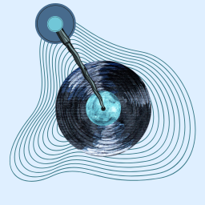

<div align="center">
  
  
  # Teefy: Retro Music Player
  
  **Upload. Share. Spin.** 
</div>

<br/>

**Teefy** is a stunning, single-page application featuring a retro-styled music player with a fully integrated shared library. 

### ✨ Features
- **Authentic Retro Players**: Choose between beautifully animated Classic Vinyl, Sleeve Vinyl, Mini Widgets, and Cassette tape UI themes.
- **Universal Shared Library**: Log in to upload your favorite tracks. Any uploaded song instantly becomes available to everyone in the shared library.
- **Seamless Authentication**: Secure login, sign-up, and password management powered by Supabase Auth.
- **Serverless Architecture**: Built with raw HTML, CSS, and JS. It connects directly to Supabase—no complex build steps or backend servers required.

---

## 🚀 Quick Start Guide

Set up your own Teefy instance in just a few minutes.

### 1. Create your Supabase project (~2 minutes)

1. Go to [supabase.com](https://supabase.com) → **New project** (the free tier is enough to get started).
2. Once it's created, open **SQL Editor** in the left sidebar → **New query**.
3. Paste in the entire contents of `supabase-setup.sql` (included in this repository) and click **Run**. This creates:
   - A `songs` table (title, artist, uploader, audio URL, cover URL, duration).
   - Security rules to ensure users can only upload as themselves and delete their own tracks.
   - Two storage buckets: `audio-files` and `cover-art`.

### 2. Connect the App

1. In Supabase, navigate to **Project Settings → API**.
2. Copy the **Project URL** and the **anon public key**.
3. Open `app.js` and find the Supabase configuration block near the top:

   ```js
   const SUPABASE_URL = "https://YOUR-PROJECT-REF.supabase.co";
   const SUPABASE_ANON_KEY = "YOUR-SUPABASE-ANON-PUBLIC-KEY";
   ```

4. Replace both values with your own and save. Your app is now wired up!

### 3. (Recommended) Streamline Testing

By default, Supabase requires new users to click a confirmation link before they can log in. To speed up your testing:
- Go to **Authentication → Sign In / Providers → Email**.
- Toggle **Confirm email** off.
*(Remember to turn this back on before going to production!)*

### 4. Local Development

Simply open `index.html` in your browser. No local development server is required because Supabase handles all backend API calls natively. Sign up, upload an MP3, and log in from an incognito window to see the real-time shared library in action.

### 5. Deployment

Teefy is completely static and can be deployed anywhere in seconds:
- **Vercel**: Deploy instantly using the Vercel CLI (`vercel deploy`) or by connecting your GitHub repo. 
- **Netlify**: Drag and drop the folder into Netlify Drop.
- **GitHub Pages**: Push this folder to a repo and enable GitHub Pages.

---

## 🧠 Architecture Overview

- **Auth**: Handled by Supabase Auth. A user's display name is saved as `user_metadata.username` upon registration.
- **Uploading**: Audio ID3 tags (title, artist, cover art) are extracted client-side to pre-fill the form. The audio and cover are then uploaded to Supabase Storage, and a new record is created in the `songs` table.
- **Playback & Library**: The Library tab retrieves the `songs` table. Selecting a track streams it directly from the public Supabase Storage URL into the audio player—completely bypassing any intermediary servers.

## ⚠️ Important Limitations

- **File Size**: Client-side uploads are capped at 25MB (`MAX_UPLOAD_MB`) to conserve the free tier limits. Supabase's default limit is 50MB, which can be modified in **Storage → Configuration**.
- **Free Tier Storage**: Supabase's free plan currently provides 1GB of storage and 5GB of bandwidth. For larger communities, consider upgrading to a paid tier.
- **Features in Development**: 
  - Deleting tracks is enabled in the database policies, but the UI for it is still in development.
